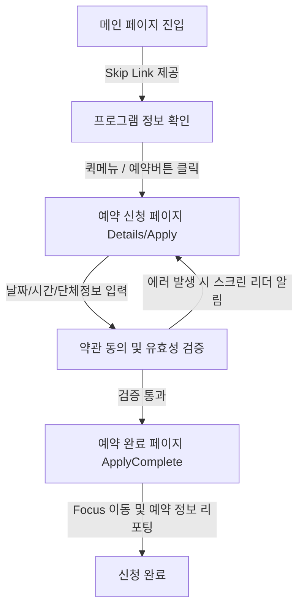

# 🏛️ 수원시립미술관 어린이 단체 전시해설 예약 시스템 및 웹 접근성 리뉴얼 프로젝트

> **"소외 없는 공공 서비스를 위한 첫걸음, 웹 접근성 표준(KWCAG 2.2)과 현대적인 사용자 경험의 융합"**

본 프로젝트는 **수원시립미술관**의 어린이 단체 전시해설 프로그램 소개 및 예약 프로세스를 전면 리뉴얼한 웹 애플리케이션입니다. 모든 사용자가 차별 없이 공공기관 서비스를 이용할 수 있도록 **한국형 웹 콘텐츠 접근성 지침(KWCAG 2.2)** 및 **WCAG 2.1 AA** 표준을 준수하여 설계·개발되었습니다.

---

## 1. 프로젝트 소개

- **설명:** 기존의 비시맨틱 레이아웃과 접근성이 미흡했던 예약 절차를 개선하기 위해 기획·디자인·개발 전 과정을 리뉴얼하였습니다. 키보드 네비게이션 보장, 스크린 리더 호환성 강화, 명도 대비 최적화 등 전반적인 접근성 지표를 극대화하고, 동시에 세련되고 직관적인 현대적 UI/UX를 Vanilla CSS로 정교하게 구축했습니다.
- **진행 기간:** 2026.04.09 ~ 2026.05.22 (43일)
- **개발 인원:** 개인 프로젝트 (기여도 100%)

## 2. 배포 및 관련 링크

- **Live Demo:** [배포된 웹사이트 링크](https://whgus118.github.io/museumofart/)
- **GitHub Repository:** [깃허브 링크](https://github.com/whgus118/museumofart)
- **Design (Figma):** [피그마 시안 링크](https://www.figma.com/design/giv7zNQhUpbiHessc6bbFq/%EA%B3%B5%EA%B3%B5%EC%82%AC%EC%9D%B4%ED%8A%B8-%EA%B0%9C%EC%84%A0--%EC%95%88%ED%8B%B0%EA%B7%B8%EB%9E%98%EB%B9%84%ED%8B%B0-?node-id=244-767&t=KC6hfnJDsGSI89hw-1)

---

## 3. 사용 기술 스택

### Frontend

- **React.js & Vite:** 컴포넌트 기반 개발로 복잡한 공공기관 UI의 유지보수성을 높이고, 빠른 응답 속도를 구현하기 위해 사용

### Design & Tools

- **Figma:** 웹 접근성 체크리스트를 기반으로 한 UI/UX 설계 및 프로토타이핑
- **Lighthouse:** 웹 접근성 진단 및 품질 지표 측정을 위한 도구 활용

### �� AI-Assisted Development (Vibe Coding)

- **Google Gemini / Antigravity:** 시맨틱 마크업 검토, ARIA 속성 최적화, 스크린 리더 호환 로직 리팩토링을 위한 페어 프로그래밍 도구로 활용
- **AI 활용 목표:** 복잡한 공공기관의 정보 구조를 논리적인 접근성 표준에 맞춰 빠르게 재구성하고 오류를 사전에 방지

---

## 4. 사용자 작업 흐름

**주요 과업: **



1. **메인 페이지 진입:** 본문 바로가기 링크 제공 및 주요 전시 정보(`Section1`), 세부 해설 코스(`Section2`), 관람 안내 및 오시는 길 탭 인터랙션(`Section3`), 예약 방법 안내(`Section4`) 확인.
2. **상세 정보 및 신청 페이지 이동:** 퀵 메뉴(Quick Menu)나 메인 링크를 통해 상세 안내(`DetailsPage`) 및 예약 신청 Form 페이지(`ApplyPage`)로 진입.
3. **예약 정보 입력:** 예약 날짜, 시간 선택 및 단체명, 신청자명, 인원수, 연락처 기입.
4. **개인정보 수집 및 이용 동의:** 동의 체크박스 미선택 시 브라우저 내 포커스 포커싱 및 스크린 리더 음성으로 사용자 친화적 에러를 안내하며 흐름을 가이드.
5. **예약 완료:** 신청이 완료되면 예약 완료 페이지(`ApplyCompletePage`)로 리다이렉트되어 완료 확인 정보 리포팅 및 접근성 포커스가 완료 타이틀로 전환됨.

---

## 5. AI 활용 및 개발 워크플로우 (Vibe Coding)

생성형 AI 페어 프로그래밍 도구인 **Google Gemini** 및 **Antigravity**를 개발 라이프사이클 전반에 적극 활용하여 고품질의 접근성 설계를 완성했습니다.

- **접근성 중심 설계 가속화:** KWCAG 지침 데이터셋을 활용해 비시맨틱 코드를 완벽한 시맨틱 구조(`section`, `article`, `header` 등)로 교정하고, 복잡한 ARIA 속성의 상태 값(`aria-expanded`, `aria-controls`) 관리를 효율적으로 작성했습니다.
- **버그 해결 및 리팩토링:** 예약 폼 필드의 포커스 트랩 방지 및 예외 상황(체크박스 미선택 시 경고 메시지 표시 및 포커싱 이동) 처리 시 AI와 페어 프로그래밍을 진행하여 코드 안정성을 크게 개선했습니다.
- **CSS 시각 정렬 및 테마 일관성:** 헤더와 푸터 간의 레이아웃 간섭을 방지하고, 메인 슬라이드 배너와 퀵 메뉴의 디자인 균형을 맞추기 위해 CSS 속성 표준화를 가이드받았습니다.

---

## 6. 핵심 구현 기능

- **웹 접근성 표준 준수:** 키보드 전용 사용자, 시각 장애인(스크린 리더)을 위한 시맨틱 마크업 및 초점(Focus) 관리 최적화
- **반응형 웹 디자인(RWD):** 모바일 기기에서도 공공 서비스 이용에 불편함이 없도록 유연한 그리드 시스템 적용
- **고대비 모드 지원:** 시력이 낮은 사용자를 위한 고대비 테마(High Contrast) 전환 기능 구현

---

## 7. 디렉토리 구조

```text
museumofart/
├── .github/                # GitHub CI/CD 워크플로우
├── docs/                   # 프로젝트 관련 기획 및 분석 문서
├── public/                 # 정적 리소스 (이미지, 폰트 등)
├── src/                    # 애플리케이션 소스 코드
│   ├── assets/             # 프로젝트 내부 이미지 및 아이콘 애셋
│   ├── components/         # 전역 및 섹션별 공통 UI 컴포넌트
│   │   ├── Header.jsx      # 네비게이션 드롭다운을 포함한 헤더
│   │   ├── Footer.jsx      # 접근성 표준을 준수하는 공공기관 푸터
│   │   ├── MainBanner.jsx  # 접근성 제어가 가능한 반응형 슬라이드 배너
│   │   ├── QuickMenu.jsx   # 예약 및 탑 버튼 바로가기 플로팅 퀵 메뉴
│   │   ├── Section1 ~ 4    # 홈 화면을 구성하는 각 상세 테마 섹션
│   │   └── ScrollToTop.jsx # 페이지 전환 시 스크롤 최상단 리셋 유틸
│   ├── pages/              # 라우팅 기준 화면 단위 페이지 컴포넌트
│   │   ├── Home.jsx        # 메인 홈 화면
│   │   ├── DetailsPage.jsx # 어린이 프로그램 상세 안내 페이지
│   │   ├── ApplyPage.jsx   # 다이내믹 폼과 접근성 에러 제어를 갖춘 예약 신청 페이지
│   │   └── ApplyCompletePage.jsx # 예약 확인서 제공 및 초점 리셋 완료 페이지
│   ├── App.jsx             # 라우터 및 글로벌 컴포넌트 레이아웃 구성
│   ├── main.jsx            # React 렌더링 진입점
│   ├── App.css             # 앱 전역 레이아웃 스타일
│   └── global.css          # 디자인 시스템 표준 CSS 변수 및 공통 초기화 스타일
├── tests/                  # Playwright 테스트 스위트
│   └── accessibility.spec.js # Axe-core 기반 자동화 웹 접근성 테스트 스크립트
├── playwright.config.js    # Playwright E2E 테스트 구성 파일
├── vite.config.js          # Vite 번들러 및 개발 서버 환경 설정
└── package.json            # 프로젝트 디펜던시 및 스크립트 정보
```

---

## 8. 회고 및 인사이트

**웹 접근성은 옵션이 아닌 기본:** 화려한 모션과 스타일링을 구현하는 것만큼이나, 키보드 전용 사용자와 스크린 리더 사용자가 똑같이 완벽한 정보를 제공받을 수 있도록 배려하는 설계가 진정한 의미의 '사용자 경험(UX) 극대화'이자 프론트엔드 개발자의 사회적 책무임을 깊이 체감했습니다.
**테스트 자동화의 중요성:** 수동으로 웹 접근성을 하나하나 마우스와 키보드로 체킹하는 번거로움에서 벗어나, `Axe-core`와 `Playwright`를 통해 개발 단계에서 구조적 마크업 오류나 명도 대비 위반 등을 실시간으로 검출 및 조치함으로써 코드 품질 신뢰도를 획기적으로 상승시켰습니다.
**AI-Assisted (Vibe Coding)의 도약:** 단순한 기계적 코드 생성을 넘어, 표준 웹 지침을 AI에 러닝시키고 코드의 호환성과 구조적 완성도를 함께 다듬어 나가는 최적의 페어 프로그래밍 경험을 통해 개발 생산성의 새로운 비전을 발견했습니다.
