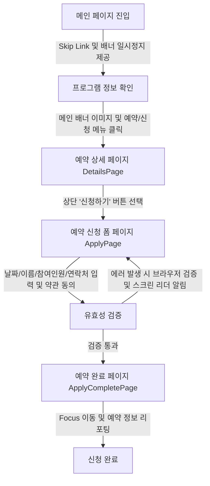

# 🏛️ 수원시립미술관 어린이 단체 전시해설 예약 시스템 및 웹 접근성 리뉴얼 프로젝트

> **"소외 없는 공공 서비스를 위한 첫걸음, 고령층 인지 특성을 반영한 도슨트형 UI와 웹 접근성 표준(KWCAG 2.2)의 융합"**

본 프로젝트는 **수원시립미술관**의 어린이 단체 전시해설 프로그램 소개 및 예약 프로세스를 전면 리뉴얼한 반응형 웹사이트입니다. IT 숙련도가 낮은 고령층도 타인의 도움 없이 서비스를 이용할 수 있도록 고령층 친화적 UI/UX를 구현했으며, **한국형 웹 콘텐츠 접근성 지침(KWCAG 2.2)** 및 **WCAG 2.1 AA** 표준을 준수하여 설계·개발되었습니다.

---

## 1. 프로젝트 소개

- **설명:** 기존 대형 배너 위주의 미니멀한 수원시립미술관 웹사이트는 고령 사용자에게 '어디가 클릭 가능한 버튼인지', '화면이 왜 제멋대로 움직이는지' 혼란을 주는 높은 진입장벽이 존재했습니다. 본 프로젝트는 IT 숙련도가 낮은 고령층(72세 페르소나)도 타인의 도움 없이 스스로 전시를 예약하고 편의시설을 찾을 수 있도록 '친절하고 직관적인 도슨트형 UI'로 리디자인한 반응형 웹사이트입니다. 한국형 웹 콘텐츠 접근성 지침(KWCAG 2.2)을 준수하며, 고령층의 인지적·신체적 제약을 극복하는 UX 장치들을 React와 Vanilla CSS로 정교하게 구현했습니다.
- **진행 기간:** 2026.04.09 ~ 2026.05.22 (43일)
- **개발 인원:** 개인 프로젝트 (기여도 100%)

## 2. 배포 및 관련 링크

- **Live Demo:** [배포된 웹사이트 링크](https://whgus118.github.io/museumofart/)
- **GitHub Repository:** [깃허브 링크](https://github.com/whgus118/museumofart)
- **Design (Figma):** [피그마 시안 링크](https://www.figma.com/design/giv7zNQhUpbiHessc6bbFq/%EA%B3%B5%EA%B3%B5%EC%82%AC%EC%9D%B4%ED%8A%B8-%EA%B0%9C%EC%84%A0--%EC%95%88%ED%8B%B0%EA%B7%B8%EB%9E%98%EB%B9%84%ED%8B%B0-?node-id=244-767&t=KC6hfnJDsGSI89hw-1)

---

## 3. 사용 기술 스택

### Frontend

- **React.js & Vite:** 컴포넌트 기반 개발로 복잡한 공공기관 UI의 유지보수성을 높이고, 빠른 응답 속도를 구현하기 위해 사용

### Design & Tools

- **Figma:** 웹 접근성 체크리스트를 기반으로 한 UI/UX 설계 및 프로토타이핑
- **Lighthouse:** 웹 접근성 진단 및 품질 지표 측정을 위한 도구 활용

### 🤖 AI-Assisted Development (Vibe Coding)

- **Google Gemini / Antigravity:** 시맨틱 마크업 검토, ARIA 속성 최적화, 스크린 리더 호환 로직 리팩토링을 위한 페어 프로그래밍 도구로 활용
- **AI 활용 목표:** 복잡한 공공기관의 정보 구조를 논리적인 접근성 표준에 맞춰 빠르게 재구성하고 오류를 사전에 방지

---

## 4. 사용자 작업 흐름

**주요 과업: 고령 사용자의 인지적 과부하를 줄인 어린이 단체 전시해설 예약 및 편의시설 탐색**



1. **메인 페이지 진입 및 탐색:** 본문 바로가기 링크(Skip Link) 및 GNB 핵심 메뉴 버튼 제공(`Section1`), 주요 전시 정보 캐러셀(`Section2`), 오시는 길 지도 및 대중교통/주차 안내 탭 인터랙션(`Section3`), 미술관 종류 알아보기 버튼(`Section4`).
2. **예약 상세 페이지 이동:** 시각적 피드백이 명확한 메인 배너 이미지나 상단 GNB의 '(예약/신청)' 보조 문구가 병기된 메뉴를 통해 프로그램 상세 안내 페이지(DetailsPage)로 진입.
3. **예약 신청 폼 진입:** 상세 안내 페이지(DetailsPage) 진입 시 화면 상단에 '신청하기' 버튼을 선제적으로 노출하여 사용자가 버튼의 위치를 먼저 인지할 수 있도록 지원하며, 하단 상세 정보를 모두 읽은 후 탐색 과정에서 헤매지 않고 최종 예약 신청 Form 페이지(ApplyPage)로 빠르게 이동할 수 있도록 설계.
4. **정보 입력 및 유효성 검증:** 예약 신청 폼(ApplyPage)에서 날짜, 이름, 참여인원, 연락처 입력 및 약관 동의 후, 필수 항목 누락 시 브라우저 기본 내장 검증 기능과 스크린 리더 음성 안내를 통한 사용자 친화적 에러 가이드 확인 (오클릭 방지를 위한 면 단위 인터랙션 영역 적용).
5. **예약 완료:** 신청이 완료되면 예약 완료 페이지(ApplyCompletePage)로 화면이 전환되어 최종 예약 성공 내역을 보여주며, 이와 동시에 스크린 리더 초점(Focus)이 최상단의 완료 타이틀로 자동 이동하여 고령 사용자가 과업의 성공을 명확하게 인지할 수 있도록 지원.

---

## 5. AI 활용 및 개발 워크플로우 (Vibe Coding)

생성형 AI 페어 프로그래밍 도구인 **Google Gemini** 및 **Antigravity**를 개발 라이프사이클 전반에 적극 활용하여 고품질의 접근성 설계를 완성했습니다.

- **초기 구조 및 시맨틱 마크업 최적화:** KWCAG 지침 데이터셋을 활용해 비시맨틱 코드를 완벽한 시맨틱 구조(`section`, `article`, `header` 등)로 교정하고, 복잡한 ARIA 속성의 상태 값(`aria-expanded`, `aria-controls`) 관리를 효율적으로 가이드받아 구현했습니다.
- **예외 상황 및 폼 검증 최적화:** 예약 폼의 입력 오류나 필수값 누락 시 브라우저 내장 검증 기능을 활용하되, 스크린 리더 사용자가 표준 안내 메시지를 놓치지 않고 직관적으로 인지할 수 있도록 접근성 요소를 보완했습니다. 이 과정에서 발생할 수 있는 마크업 간섭 등의 예외 상황은 AI와 페어 프로그래밍을 통해 논리적으로 검토하며 로직의 안정성을 높였습니다.
- **CSS 표준화 및 테마 일관성:** 메인 슬라이드 배너와 퀵 메뉴의 디자인 균형을 맞추고, 고대비 모드 전환 시 헤더와 푸터 간의 레이아웃 간섭을 방지하기 위한 CSS 속성 표준화를 검증받아 개발 시간을 단축했습니다.

---

## 6. 핵심 구현 기능

- **면(Area) 단위의 너그러운 인터랙션 영역:** 정밀한 마우스 제어가 어려운 사용자의 오작동을 줄이기 위해 메뉴의 반응 영역을 단순 텍스트가 아닌 텍스트를 포함한 박스 전체 영역으로 확장하고 명확한 호버 효과 부여
- **즉각적인 시각적 피드백:** 메인 배너 포스터 마우스 오버 시 이미지 선명도 변화(Opacity/Filter 조절) 및 손가락 커서(Pointer)를 즉시 노출하여 조작의 확신을 제공
- **화살표 조준 보정:** 슬라이드 이동 화살표의 가시적 크기는 유지하되, 가상 요소(Pseudo-element)를 활용하여 투명 클릭 영역을 최소 44x44px 이상 확보함으로써 오클릭 성공 경험 제공
- **심리적 안도감을 주는 브레드크럼:** 현재 위치(홈 > 교육 > 예약/신청)를 상단에 큰 글씨로 상시 노출하여 정보 탐색 중 길을 잃지 않도록 가이드함

- **웹 접근성 표준 준수:** 키보드 전용 사용자, 시각 장애인(스크린 리더)을 위한 시맨틱 마크업 및 초점(Focus) 관리 최적화
- **반응형 웹 디자인(RWD):** 모바일 기기에서도 공공 서비스 이용에 불편함이 없도록 유연한 그리드 시스템 적용
- **고대비 모드 지원:** 시력이 낮은 사용자를 위한 고대비 테마(High Contrast) 전환 기능 구현

---

## 7. 디렉토리 구조

```text
museumofart/
├── .github/                # GitHub CI/CD 워크플로우
├── docs/                   # 프로젝트 관련 기획 및 분석 문서
├── public/                 # 정적 리소스 (이미지, 폰트 등)
├── src/                    # 애플리케이션 소스 코드
│   ├── assets/             # 프로젝트 내부 이미지 및 아이콘 애셋
│   ├── components/         # 전역 및 섹션별 공통 UI 컴포넌트
│   │   ├── Header.jsx      # 네비게이션 드롭다운을 포함한 헤더
│   │   ├── Footer.jsx      # 접근성 표준을 준수하는 공공기관 푸터
│   │   ├── MainBanner.jsx  # 접근성 제어가 가능한 반응형 슬라이드 배너
│   │   ├── QuickMenu.jsx   # 예약 및 탑 버튼 바로가기 플로팅 퀵 메뉴
│   │   ├── Section1 ~ 4    # 홈 화면을 구성하는 각 상세 테마 섹션
│   │   └── ScrollToTop.jsx # 페이지 전환 시 스크롤 최상단 리셋 유틸
│   ├── pages/              # 라우팅 기준 화면 단위 페이지 컴포넌트
│   │   ├── Home.jsx        # 메인 홈 화면
│   │   ├── DetailsPage.jsx # 어린이 프로그램 상세 안내 페이지
│   │   ├── ApplyPage.jsx   # 다이내믹 폼과 접근성 에러 제어를 갖춘 예약 신청 페이지
│   │   └── ApplyCompletePage.jsx # 예약 확인서 제공 및 초점 리셋 완료 페이지
│   ├── App.jsx             # 라우터 및 글로벌 컴포넌트 레이아웃 구성
│   ├── main.jsx            # React 렌더링 진입점
│   ├── App.css             # 앱 전역 레이아웃 스타일
│   └── global.css          # 디자인 시스템 표준 CSS 변수 및 공통 초기화 스타일
├── tests/                  # Playwright 테스트 스위트
│   └── accessibility.spec.js # Axe-core 기반 자동화 웹 접근성 테스트 스크립트
├── playwright.config.js    # Playwright E2E 테스트 구성 파일
├── vite.config.js          # Vite 번들러 및 개발 서버 환경 설정
└── package.json            # 프로젝트 디펜던시 및 스크립트 정보
```

---

## 8. 회고 및 인사이트

**웹 접근성은 옵션이 아닌 기본:** 화려한 모션과 스타일링을 구현하는 것만큼이나, 키보드 전용 사용자와 스크린 리더 사용자가 똑같이 완벽한 정보를 제공받을 수 있도록 배려하는 설계가 진정한 의미의 '사용자 경험(UX) 극대화'이자 프론트엔드 개발자의 사회적 책무임을 깊이 체감했습니다.
**테스트 자동화의 중요성:** 수동으로 웹 접근성을 하나하나 마우스와 키보드로 체킹하는 번거로움에서 벗어나, `Axe-core`와 `Playwright`를 통해 개발 단계에서 구조적 마크업 오류나 명도 대비 위반 등을 실시간으로 검출 및 조치함으로써 코드 품질 신뢰도를 획기적으로 상승시켰습니다.
**AI-Assisted (Vibe Coding)의 도약:** 단순한 기계적 코드 생성을 넘어, 표준 웹 지침을 AI에 러닝시키고 코드의 호환성과 구조적 완성도를 함께 다듬어 나가는 최적의 페어 프로그래밍 경험을 통해 개발 생산성의 새로운 비전을 발견했습니다.

<!-- [기술보다 중요한 배려, 웹 접근성]
단순히 화려한 모션과 스타일링을 구현하는 것만큼이나, "화면이 제멋대로 움직여서 무섭다"던 72세 페르소나의 두려움을 해소하기 위해 배너 일시정지 버튼을 만들고 클릭 영역을 넓히는 '기술적 배려'가 중요함을 깨달았습니다. 소외 없는 설계를 통해 과업 수행 속도 50% 단축, 오클릭 40% 감소라는 목표 KPI를 고민하는 과정 자체가 프론트엔드 개발자의 본질적인 책무임을 깊이 체감했습니다.

[AI와의 협업, Vibe Coding의 가능성]
AI 도구를 단순한 코드 자동 생성이 아닌, 표준 지침 준수 여부를 검증하는 '접근성 감리 파트너'로 활용했습니다. Axe-core와 Playwright를 통한 자동화 테스트와 더불어, AI에게 표준 가이드라인을 러닝시키고 코드의 호환성과 구조적 완성도를 함께 다듬어 나가는 협업을 통해 프론트엔드 개발 생산성의 새로운 비전을 발견했습니다. -->
